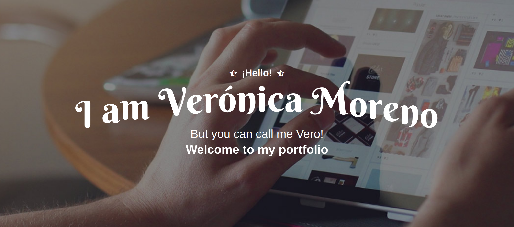

<!--div style="text-align:center"></div-->

```shell
 { “name” : “Verónica Moreno Flores”,
   “role” : “Frontend Dev | MERN Stack”,
   “data” : 
     { 
      "Linkedin" : "https://www.linkedin.com/in/vmorenoflores/", 
      "Resume"   : "https://veromoreno.github.io/",
      "IG"       : "https://www.instagram.com/veritechie"
     }
 }
```

<h3>
  🚀 Principal Stack
</h3> 
<p>
  
  
  
  
</p>
  
<h4>Programming Languages</h4>
<p>
  
</p>
<h4>Frontend Development</h4>
<p>
  
  
  
  
</p>
<h4>Backend Development</h4>
<p>
  
  
  
   
  
</p>
<h4>Tools & Technologies</h4>
<p>
  
  
  
  
  
  
  
</p>
</br>

### 🌱 I'm currently learning... / Last Projects

- GraphQL / Heroku / Docker 
- Advance React JS
- MEAN Stack Course (With official certificate in MongoDB)
</br>

### <a href="https://www.instagram.com/veritechie" target="blank"></a>  <a href="https://www.instagram.com/veritechie" target="_blank">Veritechie</a>
My objective is to be able to share and motivate people who feel a strong concern for development, programming and the technology sector. I have always been able to transmit good feelings when communicating with others and I am always willing to help, that is why I enjoy providing the necessary information to all those interested in technology. <a href="https://www.instagram.com/veritechie" target="_blank">We are almost already 80K!</a>
</br>

### 🗣 Veronica as speaker
[](https://www.instagram.com/p/CcBYOECjp6s/) 
**Colloquium of Women for Change 👩‍💻CODERS** \
Talk to inspire future generations about great opportunities
that offers the figure of women in technology and Esports sectors [Click to see](https://www.instagram.com/p/CcBYOECjp6s/) 

---
[](https://www.instagram.com/tv/CZzVgSdFGU1/?igshid=MDJmNzVkMjY%3D) 
**Technology has no gender** \
Visibility of women in the world of Technology, know the factors that weaken women in the Steam career. Very important for our society. [Click to see](https://www.instagram.com/tv/CZzVgSdFGU1/) 

---
[](https://www.youtube.com/watch?v=MEkkblYUEOM) 
**The Future of Women in Tech Summit | Banco Santander & Mongo DB** \
A session led by inspiring women that have built a successful career in the IT sector. We will break stereotypes and gender barriers, reinforce the value of diversity for business innovation, and help you get ready to lead the future. [Click to see](https://www.youtube.com/watch?v=MEkkblYUEOM) 

--- 
</br>

### Sometimes I write 
 


<a href="https://dev.to/veritechie">  </a>

### Github Stats:

<table>
  <tr>
    <td valign="top"></td>
    <td valign="top"></td>
  </tr>
</table>


#### 🎧 I love music! | Spotify Playing
[]()
